# viewNodes_Andriod

A UI framework created by flutter to support andriod devices to be integrated to boyplatform board section backend.

# Attention

1.Please download both google andriod 'API28&29' into your local andriod SDK package to prepare your develop evironment.

2.If you want to init the flutter dev dependencies under Chinese network, you may need to prepare VPN to help you getting them from oversea flutter dependency components' provider site.

## HomePage

   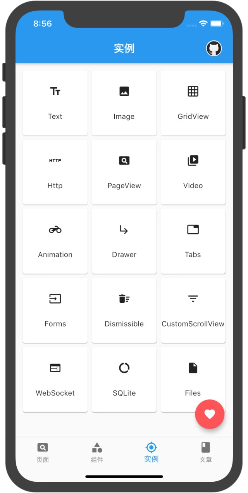 
   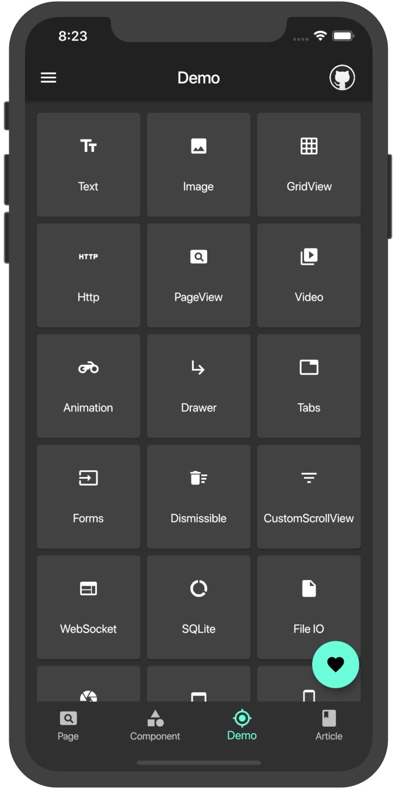 

## Normal Pages

- Guide Page
  
  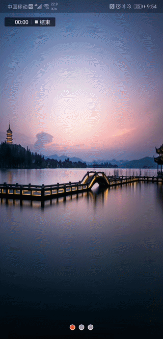
  
- Xi You

  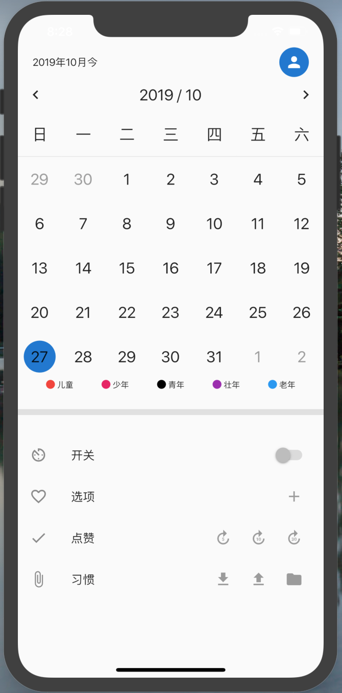

- You Qi

  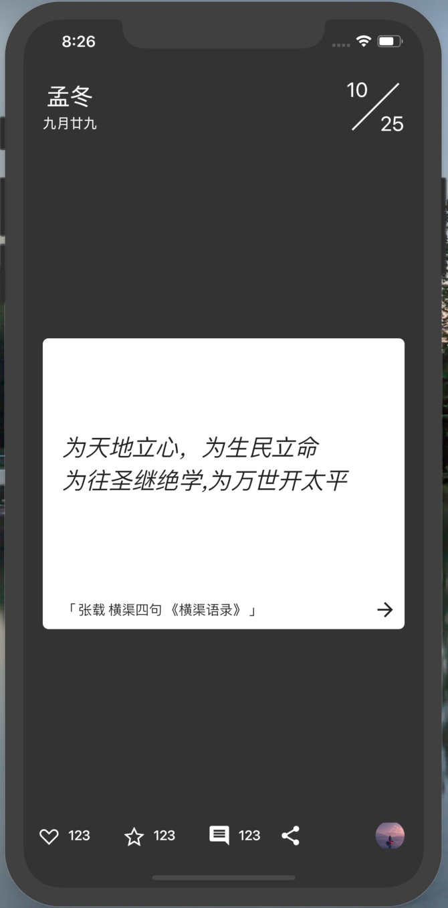
  
- Calendar

  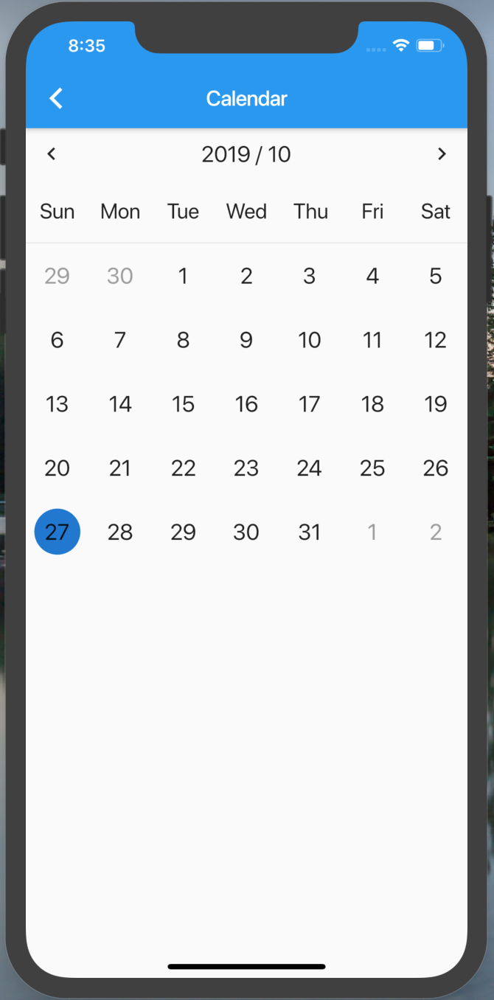
  
- CustomPaint

  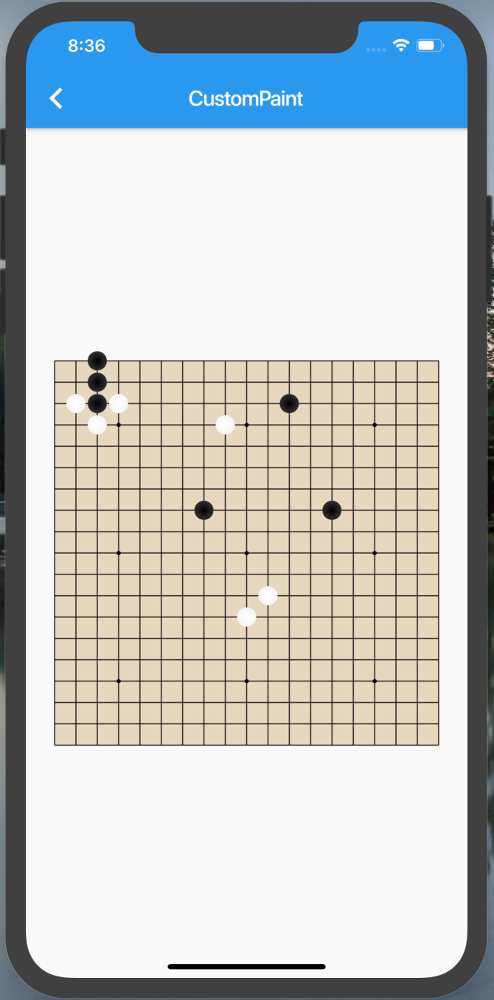
  
- Icon Font
  
  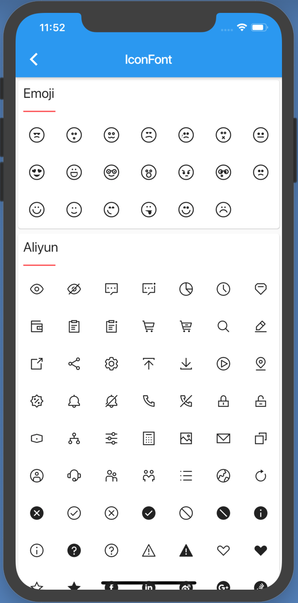
  
## Demos

- GridView Demo
  
  

     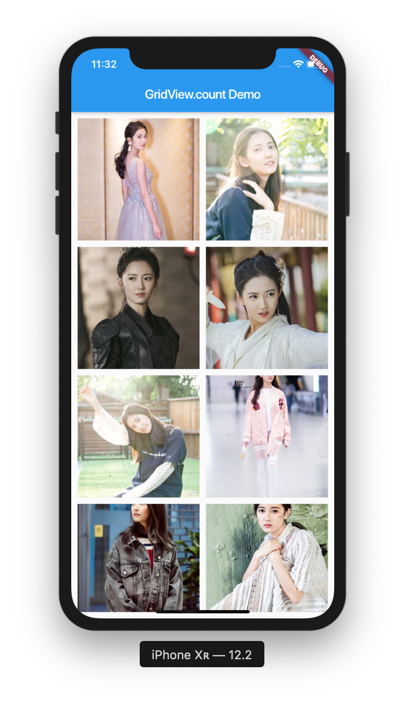
     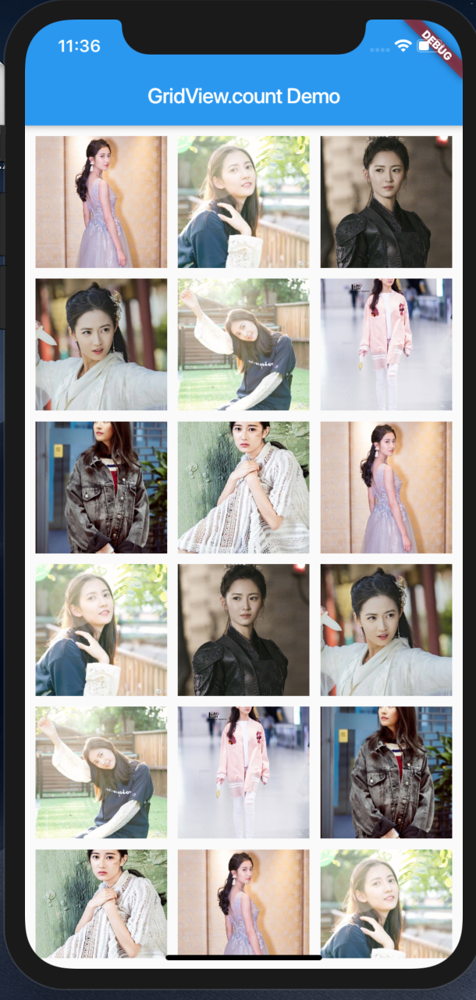
     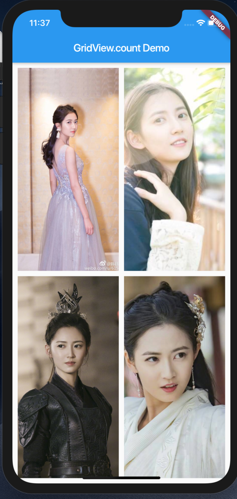
     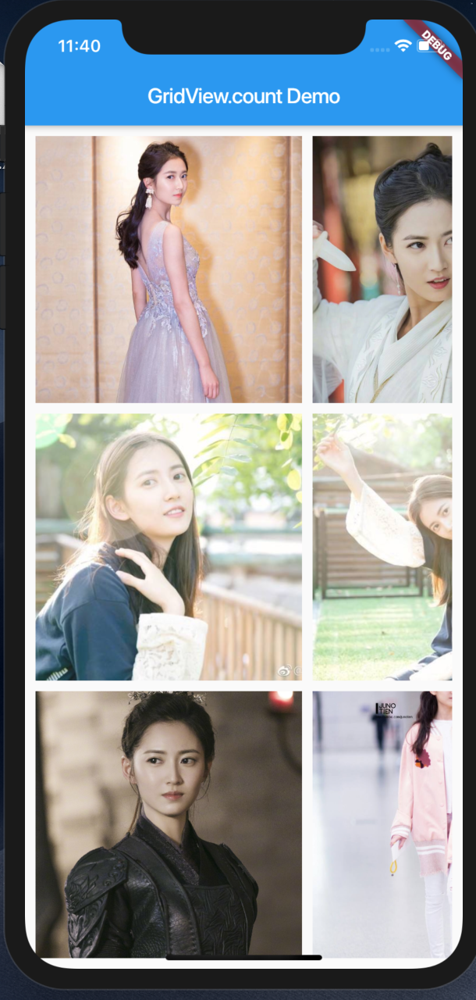
  

  

